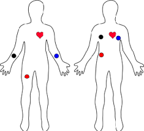

# CardioCrisisCrew
Project created as part of 601.444 Medical Device Cybersecurity at Johns Hopkins.

Authors: Jason Mihalopoulos, Madeline Estey, Casey Burhoe, and Lily Wheeler

## Project Overview
We developed the CC ECG as a secure medical device designed for first aid kits in public buildings, enabling faster diagnosis and treatment for patients experiencing cardiac emergencies.

### Overview of System Use
If someone experiences a cardiac emergency in a public space equipped with a first aid kit, they or a bystander can retrieve the CC ECG device. The three ECG electrodes are placed on the patient, and the device is powered on. When emergency medical personnel arrive, they can open the CC ECG app, connect to the device via Bluetooth, and instantly access the patient's heart data to assess the situation and determine treatment. If needed, the data can also be transmitted to a hospital for further care.

### Patient Benefits
The product enables real-time visualization of cardiac irregularities, helping medical personnel respond quickly and accurately. It provides peace of mind for at-risk patients and, through data sharing with emergency departments, reduces response times and increases survival chances.

### Patient Risks
A device breach could jeopardize patient safety by delaying or blocking alerts to patients and emergency personnel. If attackers alter ECG data, a serious emergency could appear as a normal reading, risking improper or delayed treatment.

### System integration
The device will integrate with both a mobile app via Bluetooth, and a cloud platform (of the desired hospital) via WiFi. The device will not directly integrate with EHRs, but hospitals can manually do that on their own. 

### Hardware bill of materials
- Raspberry Pi 5
- AD8232 ECG sensor
- ADS1115 Analog-to-Digital Converter
- iPhone
- 40 PCS 20 CM Breadboard Jumper Wires
- Disposable Surface ECG Electrode
- Sensor Cable - Electrode Pads
- Raspberry Pi 27W Power Supply

### Firmware, Software, Services
- Raspberry Pi OS
- AWS Cloud platform
- Lambda, API Gateway, Cognito, DynamoDB
- SQLite database
- iOS application
- BLE - Gobbledegook library
- Tailscale

# System Setup
Instructions for end users (EMTs, medical personnel) to set up and use the CC ECG system.

## App Setup
The CC ECG iOS app enables EMTs to connect to the Raspberry Pi device via Bluetooth, view ECG readings in real time, and upload them to the cloud.

### Prerequisites
- An iPhone with iOS 15 or later
- The CC ECG app installed (provided by your organization)

### 1. Install the App
- Download the CC ECG app from your organization's app distribution method
- Install and open the app on your iPhone
- Grant necessary permissions for Bluetooth and notifications when prompted

### 2. Connect to the Device
- Ensure the Raspberry Pi device is powered on and running
- In the app, tap "Scan for Devices" to find nearby CC ECG devices
- Select your device from the list to establish a Bluetooth connection
- Wait for the connection status to show "Connected"

### 3. View ECG Data
- Once connected, the app will automatically display real-time ECG readings
- The graph shows the last 30 seconds of heart activity
- Raw data values are displayed below the graph
- Data automatically uploads to the cloud for hospital access

### 4. End Session
- When finished, tap "Disconnect" to end the Bluetooth connection
- The session data remains available in the cloud for medical records

## Device Setup
The physical ECG device collects and stores heart data. 

**Note:** For our purpose, we used an outlet as a power source. However, in a real-world scenario, a battery pack should be attached to the device before use.

### 1. Place Electrodes
- Three electrodes need to be placed on the body
  

### 2. Turn on Device and Begin Data Collection
- Press the black button on the device
- Data collection is occurring while blue LED on device is on
- Data collection sessions last 30 seconds, as currently configured
- Can press button multiple times if more data is desired

# Security
Security was integrated into every stage of the CC ECG's development — from requirements gathering and architecture design to implementation and testing. Our approach followed recognized medical device cybersecurity standards and regulatory guidance to ensure safety, reliability, and compliance.

## Secure Development Lifecycle
We adopted a Secure Product Development Lifecycle (SPDLC) approach, including:

- **Requirements Definition**: Established cybersecurity requirements alongside functional requirements
- **Design Reviews**: Incorporated threat modeling, trust boundaries, and data flow diagrams into early-stage design
- **Risk Assessments**: Conducted both safety and cybersecurity risk assessments, with mitigation strategies implemented
- **Verification & Validation**: Tested against defined security requirements

## Cybersecurity Requirements
- EMT authentication required for device access
- End-to-end encryption for data in transit (Bluetooth, cloud uploads)
- Encryption at rest for on-device ECG data (SQLite)
- Logging and alerts for failed login attempts
- Automatic reauthentication after app closure

## Standards & Compliance
Our process aligned with established industry and regulatory frameworks, including:

- **ISO 14971** – Medical Device Risk Management
- **IEC 62304** – Medical Device Software Lifecycle
- **AAMI TIR57** – Principles for Medical Device Security
- **FDA Cybersecurity Premarket Guidance** – 2023 edition

## Threat Modeling & Risk Management
Our threat modeling identified authentication, encryption, and access control as critical to protecting patient data and device integrity. Based on this model, we defined concrete cybersecurity requirements and validated them through targeted testing. All critical tests passed.

Key Cybersecurity Controls
- Authentication & Access Control
- Encryption
- Data Protection
- Device Hardening

## Security Testing
- **Vulnerability Scanning**: Performed on device, app, and cloud components
- **Penetration Testing**: Conducted by an independent third-party team to simulate real-world attack scenarios

## Ongoing Security Maintenance
We plan to:

- Periodically re-run threat models and risk assessments
- Maintain and review an SBOM (Software Bill of Materials) for third-party component vulnerabilities
- Conduct recurring penetration tests
- Implement hospital cloud interface security reviews

# Development Setup
Instructions on how to set up the app and hardware development environments to make any changes to the project.

## App Setup
The CC ECG iOS app enables EMTs to connect to the Raspberry Pi device via Bluetooth, view ECG readings in real time, and upload them to the cloud.

### Prerequisites
- A Mac with Xcode installed
- An Apple ID (free account is sufficient for development and testing)
- An iPhone with iOS Developer Mode enabled (for Bluetooth testing)

**Note:** A free Apple ID allows you to run the app on your own iPhone for 7 days at a time. You'll need to re-sign the app every 7 days. A paid Apple Developer account ($99/year) is only required if you want to distribute the app or test on multiple devices.

### 1. Download the App Source
- Switch to the `ios-app` branch of the CardioCrisisCrew repository
- Download the `ccc/ccc.xcodeproj` file and the full `ccc/` folder (both are in the same branch)

### 2. Open in Xcode
- Open `ccc.xcodeproj` in Xcode
- In the left project navigator, select the project file (blue icon)
- Go to **Signing & Capabilities**
- Change the **Team** to your Apple Developer account
- Update the **Bundle Identifier** to a unique value (e.g., `com.yourname.CCCECG`)

### 3. Choose Run Destination
**For simulator testing (no Bluetooth):**
- Select an iOS simulator (e.g., iPhone 15) from the run destination menu

**For real device testing (Bluetooth enabled):**
- Connect your iPhone to your Mac via USB
- On your iPhone, go to **Settings → Privacy & Security → Developer Mode** and enable it
- Select your iPhone as the run destination in Xcode

### 4. Build and Run the App
- Click the **Run ▶️** button in Xcode to install and launch the app
- If prompted on your iPhone, trust the developer certificate

### 5. Pair with the Raspberry Pi
- Ensure the Pi is running the ECG service (`systemctl --user restart ecg.service`)
- In the app, scan for devices and select your Pi from the list
- Start a new session to view live ECG data

## Device Setup
The physical ECG device collects and stores heart data. 

### 1. Connect to the device
- Connect to the device so that hardware or software modifications can be implemented
- Option 1: Use an Ethernet cable to connect the device to your computer. Then, ssh into the Raspberry Pi using the following command: `ssh cccpi@192.168.4.1`
- Option 2: Connect your laptop to a wireless network that has already been configured in the Raspberry Pi settings. Connect to the pi using: `ssh cccpi@raspberrypi`

**Note:** For remote development of the device by multiple individuals, Tailscale is recommended. If Tailscale is used, the corresponding Tailscale IP would replace 'raspberrypi' in the 'Option 2' command above.

### 2. Run Data Collection Script

### 3. Run Bluetooth Configuration Script
